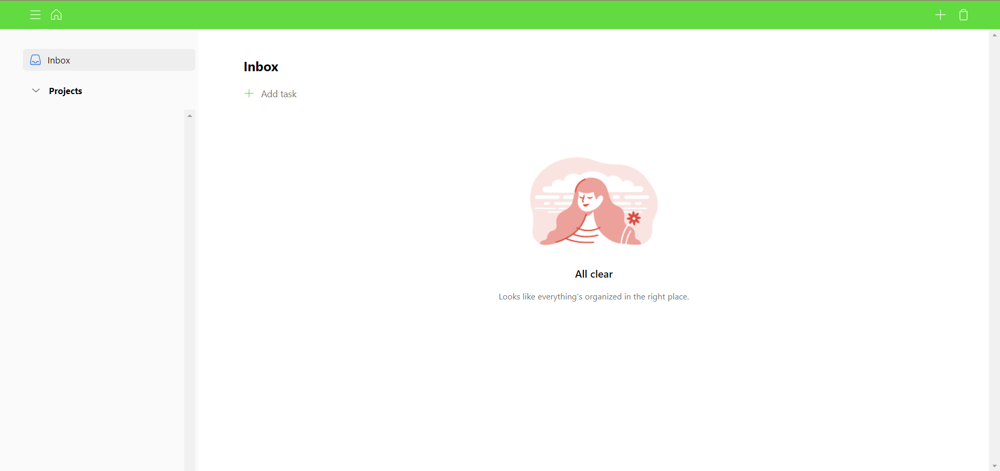
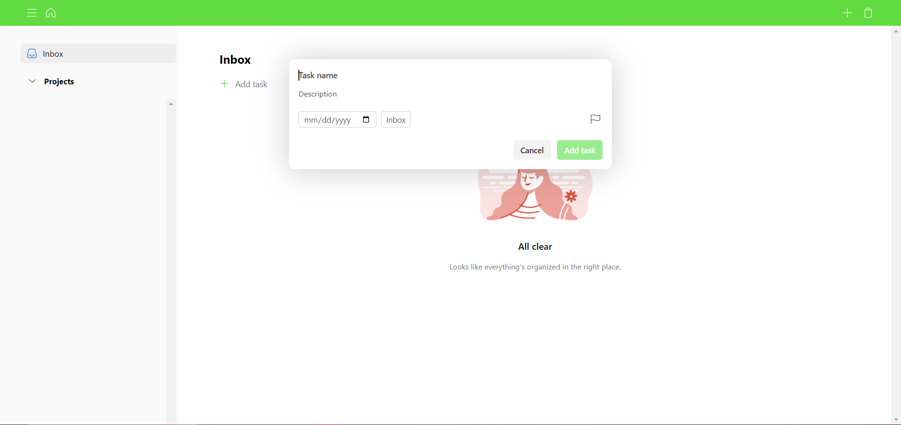
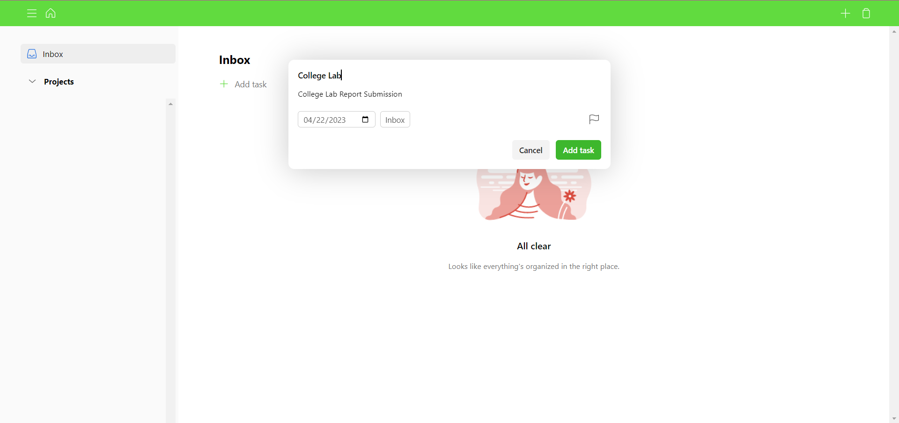
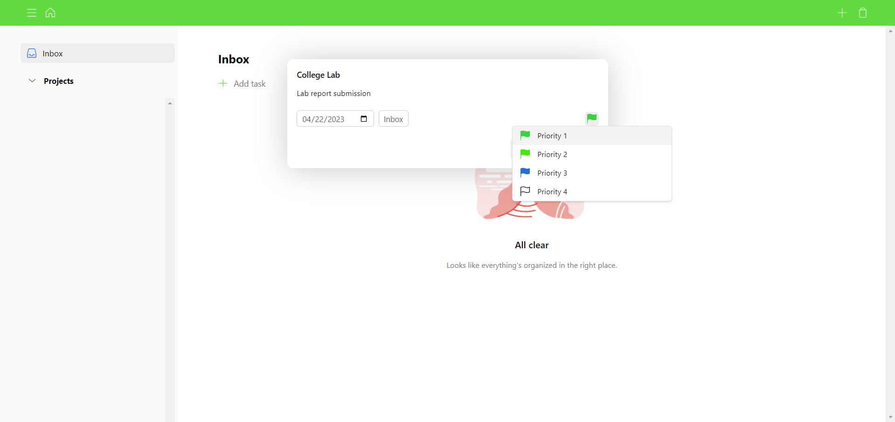
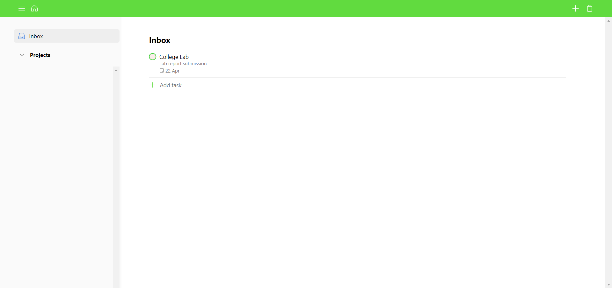

# Notion App Clone 

A simple app like notion app where one can manage their task on each day . Even we can give priority to the tasks . 4 types of priorities are there . The tasks will be arranged according to the priority .

This clone is made using HTML, CSS, JS. 

Inspired by Notion . Notion is a single space where you can think, write, and plan. Capture thoughts, manage projects, or even run an entire company — and do it exactly the way you want.

## Some Functionality 

- Add different Projects like College , Studies etc.
- Add tasks according to the projects .
- Add priority to the task .
- Four level of priority .
- Add description to the tak .
- When the task done check box .
- Remove all task with the help of clear .

## Demo 

https://user-images.githubusercontent.com/100219950/233838032-fd5298ac-5c2c-4aff-b2e1-e1a3ea79f33f.mp4

## Screen Shots

### Home Page

### Add Task

### Add Priority

### Task

## Languges Used
- HTML
- CSS
- JS
[LIVE SITE](https://notion-clone-nxt-gen.netlify.app/)

[LIVE SITE](https://souvik2376.github.io/Notion_Clone/)
